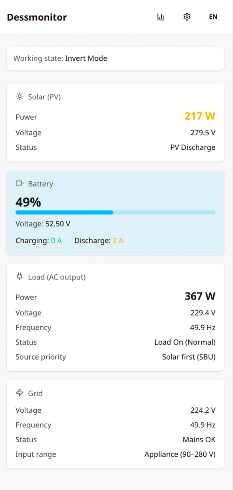

# Dessmonitor

Dashboard for monitoring DESS devices (grid, solar, battery, load) via [dessmonitor.com](https://dessmonitor.com). The goal is to see your solar inverter status immediately—the dessmonitor website is often slow. Data is automatically downloaded from dessmonitor and stored in a local database, so the app can show it right away instead of waiting on the remote site.



## Stack

- **app** — React 19, Vite 7, TypeScript 5.9, Tailwind CSS v4
- **server** — NestJS

## Structure

```
app/     — frontend (React + Vite)
server/  — NestJS backend
```

## Setup

```bash
npm install
```

1. Start the server: `npm run dev:server`
2. Start the app: `npm run dev:app`
3. Configure credentials (see [Auth flow](#auth-flow) below)

## Auth flow

Dessmonitor talks to [dessmonitor.com](https://dessmonitor.com) using a token + secret. The server stores credentials in `data/credentials.json` and uses them for all API requests.

### Option 1: Env vars (recommended)

Set in `.env`:

```
DESS_USR=user@example.com
DESS_PWD=your-password
DESS_COMPANY_KEY=your-company-key
```

On startup, if no credentials exist, the server logs in via `authSource`, fetches your devices, and stores token + secret. No manual setup needed.

### Option 2: Login API

`POST /credentials/login` with `usr`, `pwd`, `companyKey` (and optionally `baseUrl`, `pn`, `sn`, `devcode`, `devaddr`). The server authenticates with dessmonitor.com, stores credentials, and optionally fetches device list. You can also rely on `DESS_USR`, `DESS_PWD`, `DESS_COMPANY_KEY` from env when the body is empty.

### After auth

- **Reset**: Settings → "Reset credentials" calls `DELETE /credentials` and clears stored credentials. Restart with `.env` configured to reconfigure.
- **Devices**: Credentials include device params (`pn`, `sn`, `devcode`, `devaddr`) for chart/latest APIs. Devices are fetched on login or via `POST /credentials/devices/refresh`. Change device via Settings.

## Commands

| Command | Description |
|---------|-------------|
| `npm run dev:all` | Run frontend and backend together |
| `npm run dev` / `npm run dev:app` | Frontend dev server |
| `npm run dev:server` | NestJS in watch mode |
| `npm run build` | Build frontend |
| `npm run build:server` | Build server |
| `npm run lint` | Lint all workspaces |

## License

MIT.
